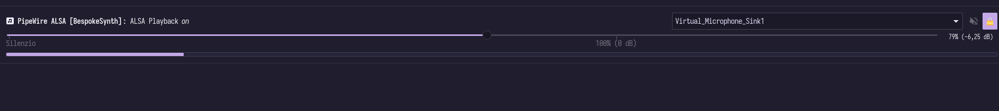
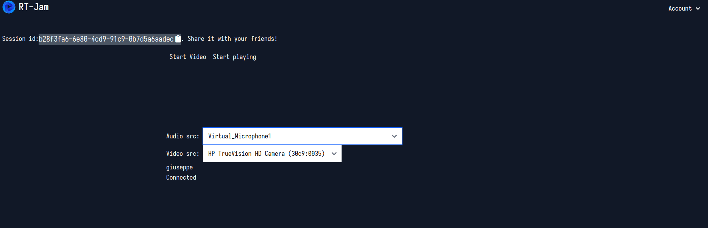

# RT-Jam

## Struttura della repository
La repository è organizzata come segue:
```
├── backend
│   ├── Cargo.toml
│   ├── certs
│   ├── Dockerfile
│   ├── migrations
│   ├── src
│   └── templates
├── Cargo.lock
├── Cargo.toml
├── common
│   ├── Cargo.toml
│   └── src
├── docker-compose.yml
├── frontend
│   ├── Cargo.toml
│   ├── dist
│   ├── Dockerfile
│   ├── index.html
│   ├── node_modules
│   ├── package.json
│   ├── pnpm-lock.yaml
│   ├── src
│   ├── static
│   ├── styles
│   └── tailwind.config.js
├── launch_chrome.sh
├── Makefile
├── protobuf
│   ├── build
│   ├── build-env-rust.Dockerfile
│   ├── Makefile
│   └── types
├── README.md
├── Trunk.toml
└── videocall-client
    ├── Cargo.toml
    ├── README.md
    ├── README.tpl
    ├── rust-toolchain.toml
    └── src

```
* **backend**: contiene il server dell'applicazione. Espone un'API JSON per la gestione delle entità e un endpoint in webtransport per la gestione dello streaming
* **frontend**: contiene il codice `yew.rs` che usa WebAssembly
* **common**: include strutture comuni sia al frontend che backend
* **protobuf**: contiene le definizioni di tipi che saranno utilizzati per lo streaming

## Compilazione ed esecuzione
L'applicazione viene gestita con un Makefile. Per ricevere tutte i comandi creati eseguire:

```bash
make help
Usage:
  up             executes the application using docker-compose
  build-images   build docker images
  build          statically build frontend and backend
  dev            creates nats and postgres container; executes backend and frontend locally
  help           prints this help message

```

### Usando docker-compose (consigliato)
L'applicazione può essere compilata ed eseguita usando il `docker-compose.yml` presente nella cartella root. Questo compilerà 
frontend e backend usando gli opportuni `Dockerfile`.

```bash
make up

```

## Esecuzione dell'applicazione
Al momento dello sviluppo solo i browser chromium-based implementano l'API WebTransport: l'
applicazione quindi **NON** funziona su altri browser. Inoltre, il protocollo QUIC rende
obbligatorio l'utilizzo del protocollo TLS. In questa repository, sono già forniti dei 
certificati generati con `openssl` (vedi sezione successiva) per eseguire l'applicazione
localmente.

Attraverso lo script `launch_chrome.sh` viene eseguita un'istanaza di chrome con parametri 
disponibili solo da riga di comando che bypassano la verifica del certificato e forzano 
l'utilizzo di localhost per connettersi al protocollo QUIC. 
```sh 
 google-chrome --origin-to-force-quic-on=127.0.0.1:4433 --ignore-certificate-errors-spki-list="$SPKI" --enable-logging --v=1
```

### Generazione di certificati ssl
I certificati SSL vengono generati con i seguenti comandi:

```sh 
    openssl req -x509 -newkey rsa:2048 -keyout "backend/certs/localhost.dev.key" -out "backend/certs/localhost.dev.pem" -days 365 -nodes -subj "/CN=127.0.0.1"
    openssl x509 -in "backend/certs/localhost.dev.pem" -outform der -out "backend/certs/localhost.dev.der"
    openssl rsa -in "backend/certs/localhost.dev.key" -outform DER -out "backend/certs/localhost.dev.key.der"
```

### Demo (linux only)
***DISCLAIMER***: la demo fa uso di sorgenti audio virtuali che stressano molto la macchina sottostante e può portare a risultati di bassa qualità.
I comandi si basano sulla presenza del demone `pulseaudio` in esecuzione sulla macchina host.

Una demo veloce può essere eseguita su un solo computer Linux creando sorgenti audio virtuali. In Linux, è possibile effettuare il routing di 
dispositivi audio attraverso il modulo `null-sink` (l'audio che entra in questo nodo non viene riprodotto da nessun dispositivo)
```sh
pactl load-module module-null-sink sink_name=virtmic1 sink_properties=device.description=Virtual_Microphone_Sink1
```

Con il modulo utilizzato, può essere catturata l'uscita attraverso il modulo remap che effettua un redirezionamento verso un ingresso a scelta
```sh 
pactl load-module module-remap-source master=virtmic1.monitor source_name=virtmic1 source_properties=device.description=Virtual_Microphone1
```

Attraverso, un'interfaccia grafica come `pavucontrol` è possibile scegliere, per tutte le applicazioni, il sink (destinazione). 


Selezionato il sink, è possibile scegliere come input dell'applicazione la sorgente audio desiderata e iniziare a inviare dati.


