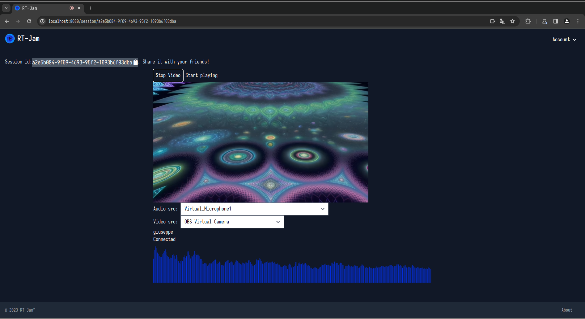
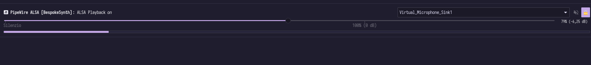
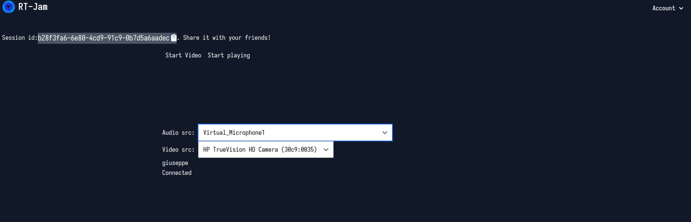

# RT-Jam



## Environment variables
The application needs the following environment variables:
* RUST_LOG="backend=debug"
* RTJAM_DATABASE_URL=""
* RTJAM_LISTEN_ADDRESS=""
* RTJAM_SESSION_KEY=""
* RTJAM_NATS_URL=""
* RTJAM_SMTP_HOST=""
* RTJAM_SMTP_PORT=""
* RTJAM_SMTP_USER=""
* RTJAM_SMTP_PASSWORD=""
* RTJAM_SMTP_FROM=""
* RTJAM_APP_URL=""
* RTJAM_WEBTRANSPORT_ADDRESS=""
* RTJAM_CERT_PATH=""
* RTJAM_KEY_PATH=""

## Repository structure
The repository is structured as follows:

* **backend**: contains the application server. It exposes a JSON API to manage system entities and a WebTransport endpoint to handle the streaming
* **frontend**: contains the web frontend built using `yew.rs` (uses WebAssembly)
* **common**: contains shared data structures between frontend and backend
* **protobuf**: contains data structures used by the streaming (serialized using the protobuf as binary protocol).

## Compiling and Running
The application is managed with a single Makefile. To get all the available commands run:
```bash
make help
Usage:
  up             executes the application using docker-compose
  down           deletes docker containers
  build-images   build docker images
  build          statically build frontend and backend
  dev            creates nats and postgres container; executes backend and frontend locally
  help           prints this help message
```

### Run using docker-compose (recommended)
The application can be built and run using `docker-compose.yml`. This will recursively build `frontend` and `backend` using
their `Dockerfile`.
```bash
make up
```

#### Notes on running the application
At the time of writing, only chromium-based browser implement the WebTransport API for stereo audio streaming (using OPUS codec).
The QUIC protocol mandates a TLS layer. To ease up tests, this repository includes  `openssl` pre-generated certificates, 
but these*must* not be used in production.

The `launch_chrome.sh` script executes a special `Chrome` session forcing to accept unconditionally these certificates. Change 
this line if you have a different server address:
```sh 
 google-chrome --origin-to-force-quic-on=127.0.0.1:4433 --ignore-certificate-errors-spki-list="$SPKI" --enable-logging --v=1
```

### Generating SSL certificates
You can generate your own certificates with the following commands:
```sh 
openssl req -x509 -newkey rsa:2048 -keyout "backend/certs/localhost.dev.key" -out "backend/certs/localhost.dev.pem" -days 365 -nodes -subj "/CN=127.0.0.1"
openssl x509 -in "backend/certs/localhost.dev.pem" -outform der -out "backend/certs/localhost.dev.der"
openssl rsa -in "backend/certs/localhost.dev.key" -outform DER -out "backend/certs/localhost.dev.key.der"
```

### Demo (linux only)
***DISCLAIMER***: the demo uses virtual audio source which can stress the underlying machine if you don't have an external encoder/decoder (ie. an audio interface). 
The following commands assume the `pulseaudio` daemon running on the host. You can create a "loopback" sink using the **null-sink** (no device will reproduce the
internal signal) with the following command:
```sh
pactl load-module module-null-sink sink_name=virtmic1 sink_properties=device.description=Virtual_Microphone_Sink1
```
You can now remap the just created sink within another input:
```sh 
pactl load-module module-remap-source master=virtmic1.monitor source_name=virtmic1 source_properties=device.description=Virtual_Microphone1
```

You can now join a room with 2 different accounts and you can choose an input and an output for the different audio channels.

You can use `pavucontrol` graphical interface to choose per application audio destination. 


You can now select the virtual-input as audio source for the application and start sending data.


